# Краткий мануал по гитлабу
## Cоздание личного репозитория с нужным .gitignore и простым README.MD

Для создания нового репозитория рядом с профилем выыбираем New project/repository

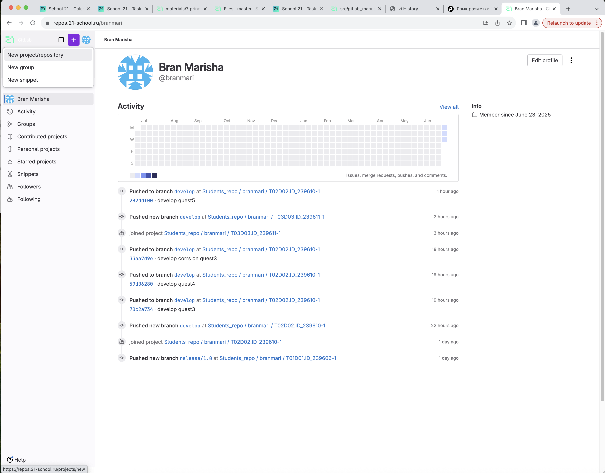

Выбираем Create blank project, записываем имя проекта и нажимаем кнопку Create project
Для создания файла .gitignore выбираем New file записываем какие файлы хотим игнорировать

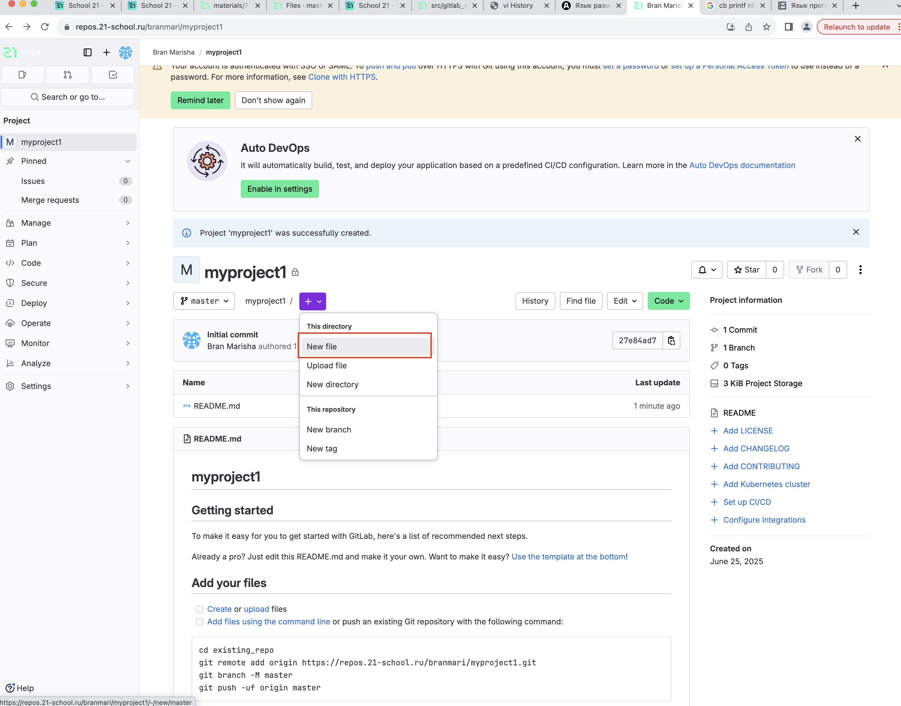

Выбираем Commit changes
Файл Readme создание и редактирование находятся как на скриншоте. Если файла не существует будет кнокпка Add README. После редактировния аналогично выбираем Commit changes

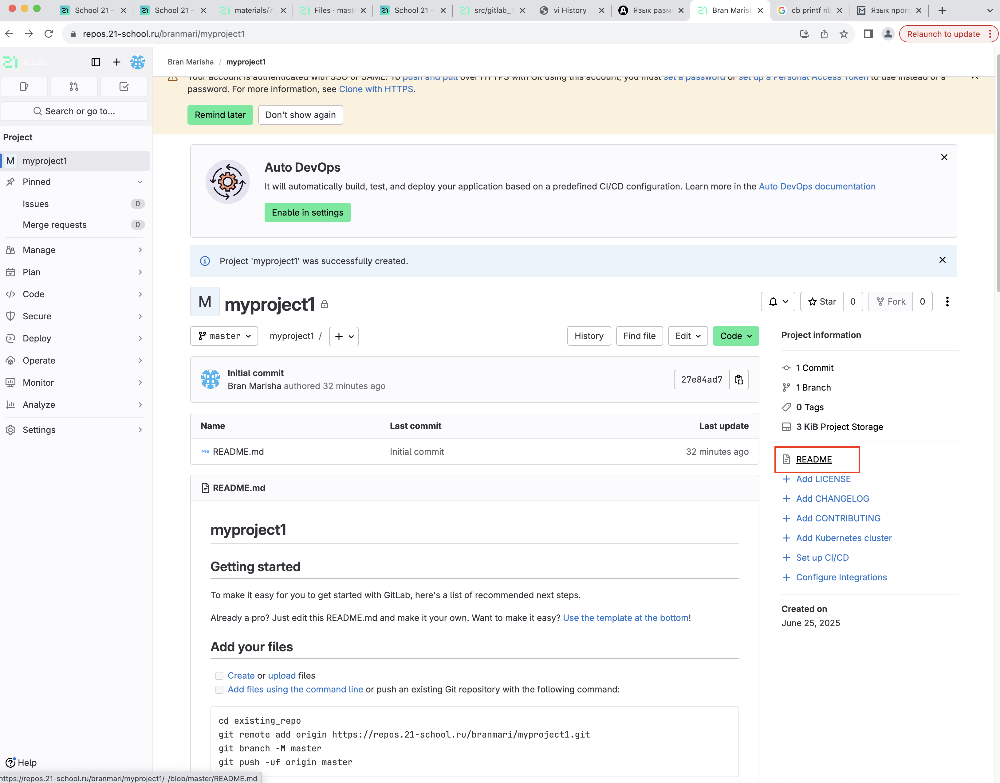

## Cоздание веток develop и master

Для создания новой ветки аналогично с новым файлом выбираем  New branch, вписываем имя develop и нажимаем Create branch

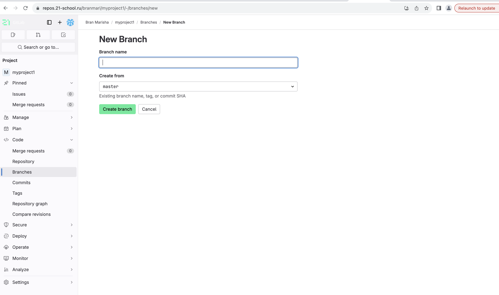

Либо переходим по вкладке слева Branches -> New branch -> Create branch

## Установка ветки develop по умолчанию

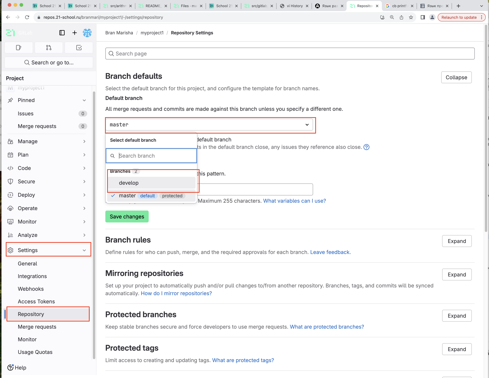

## Cоздание issue на создание текущего мануала

Чтобы создать ишью, необходимо проделать последовательно следующие шаги.

Перейти в репозитории на вкладку «Issues» и нажать на кнопку «New issue». Кнопка находится под вкладками на одной строчке с поиском и списком лейблов.

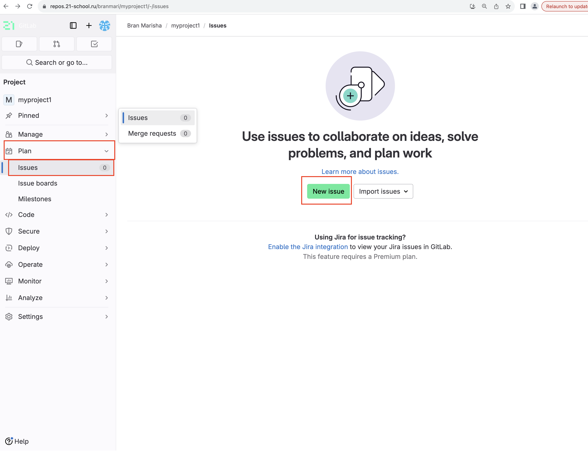

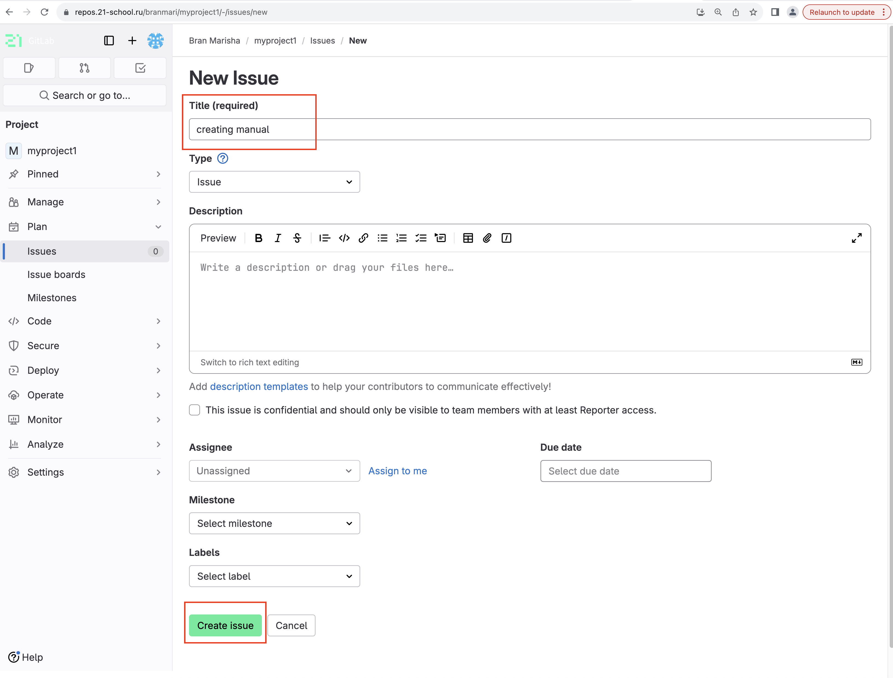

## Cоздание ветки по issue

Issues - > имя issue -> Create branch

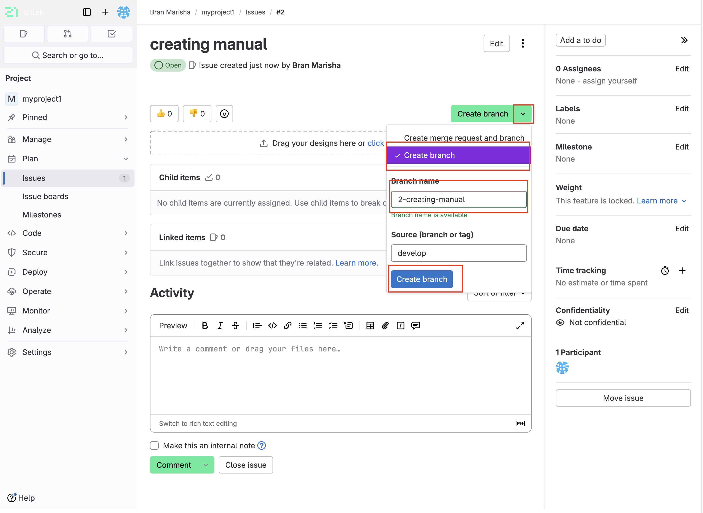

## Cоздание merge request по ветке в develop

Issues - > Create merge request

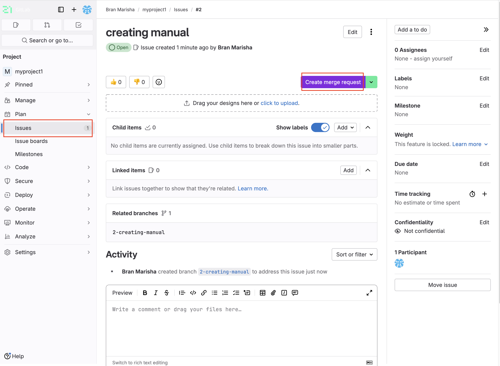

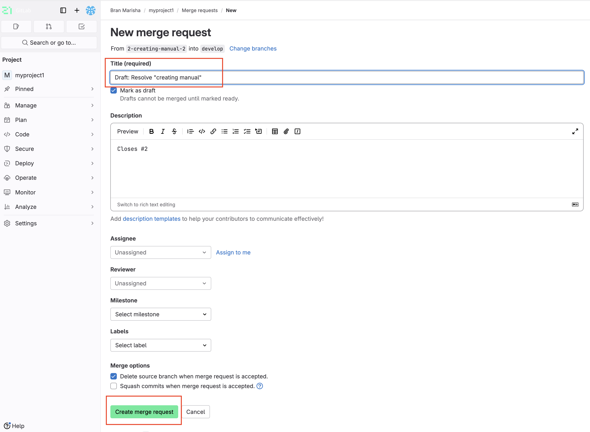

Create merge request

## Комментирование и принятие реквеста

В merge request можно оставлять комментарии в обсуждении

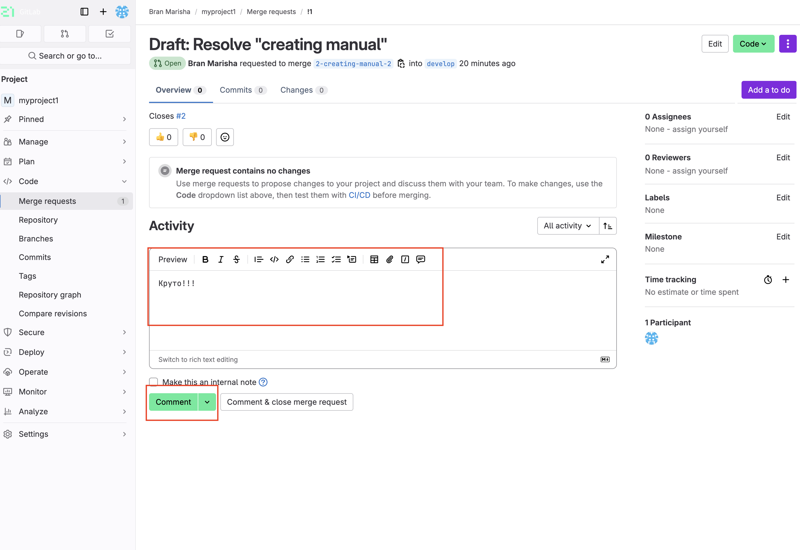

После проверки нажмите "Merge" для слияния ветки в develop

## Формирование стабильной версии в master с простановкой тега

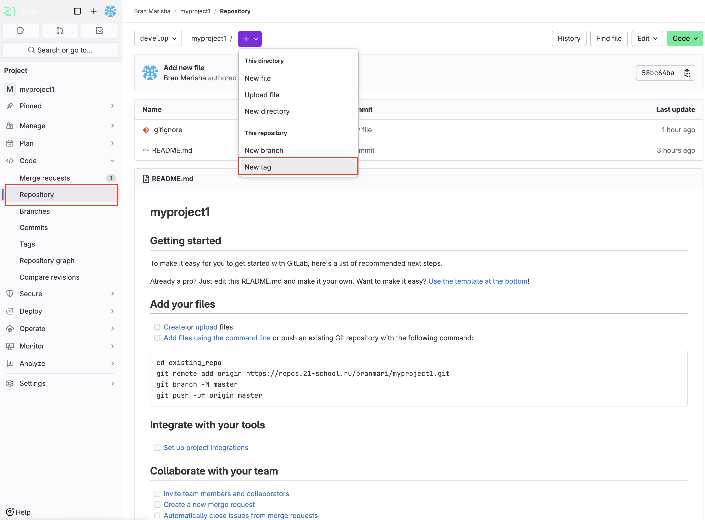

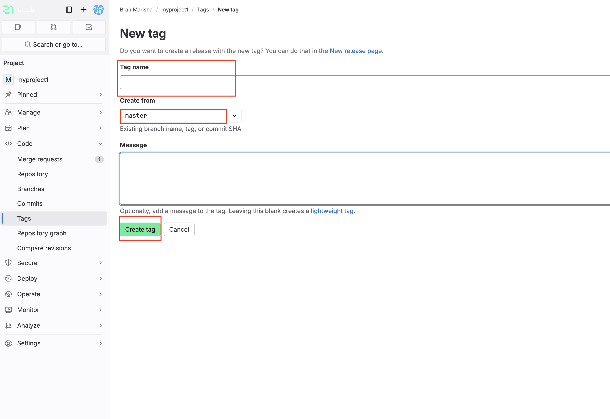

## Работа с wiki проекта

В школе 21 не доступен wiki
